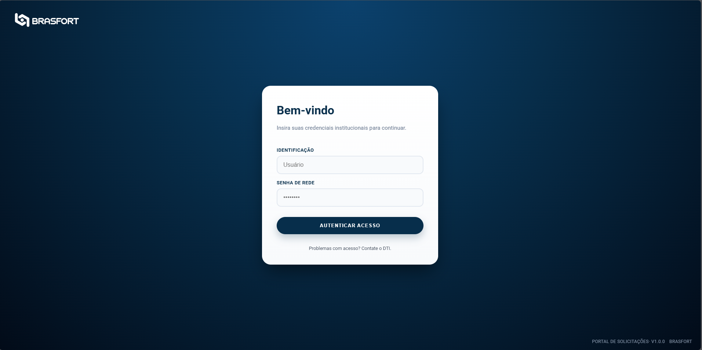

# 🏛️ Portal ABV - Sistema de Gestão Unificada

> **Status:** 🟢 Em Produção (Versão 1.0)   
> **Desenvolvedores:** Rayssen Leonardo e Danilo Vinícius

## 📋 Visão Geral
O **Portal ABV** é uma solução de alta governança desenvolvida para centralizar o acesso aos sistemas de segurança e manutenção predial. O sistema oferece autenticação segura, gestão de identidade (RBAC) e integração transparente com ferramentas de terceiros (PerformanceLab e Microsoft Power BI).

---

## 📸 Tour Visual

### 1. Autenticação Institucional
Tela de login minimalista com validação segura de credenciais e identidade visual do cliente.


### 2. Dashboard Unificado (Visão Admin)
Painel central que agrega os cartões de serviço do **PerformanceLab** (com funcionalidade de expandir/recolher) e o painel de indicadores do **Power BI** (visível apenas para Supervisores e Admins).


### 3. Gestão Rápida (Modal)
Sem sair do dashboard, o administrador pode alterar senhas e criar novos usuários rapidamente através de um modal flutuante.


### 4. Painel Administrativo (CRUD)
Área exclusiva para gestão completa da base de usuários. Permite listar, editar permissões e remover acessos.


---

### 🚀 Principais Funcionalidades
* **Autenticação Segura:** Login criptografado com padrão **OAuth2** e tokens **JWT**.
* **Gestão de Perfis (RBAC):** Controle granular de acesso (Administrador, Supervisor, Solicitante).
* **Dashboard Inteligente:**
    * Integração com Power BI (Embed seguro).
    * Links rápidos para módulos do PerformanceLab (Solicita Fácil).
    * Interface adaptativa (Cards expansíveis).
* **Painel Administrativo:** CRUD completo de usuários, redefinição de senhas e auditoria.
* **Auditoria:** Logs detalhados de acesso e ações críticas.

---

## 🏗️ Arquitetura Técnica

O projeto segue uma arquitetura moderna, containerizada e pronta para nuvem (Cloud Native).

| Componente | Tecnologia | Descrição |
| :--- | :--- | :--- |
| **Linguagem** | Python 3.11 | Core da aplicação. |
| **Framework** | FastAPI | Alta performance para APIs e rotas assíncronas. |
| **Banco de Dados** | PostgreSQL 15 | Banco relacional robusto (Prod). SQLite suportado para Dev. |
| **ORM** | SQLAlchemy | Abstração de banco de dados e proteção contra SQL Injection. |
| **Frontend** | HTML5 / CSS3 / JS | Interface leve, sem frameworks pesados (Vanilla JS). |
| **Container** | Docker | Padronização de ambiente (App + Banco). |
| **Server** | Gunicorn + Uvicorn | Gerenciamento de processos e workers para produção. |

---

## 🛠️ Instalação e Configuração

### Pré-requisitos
* [Docker Desktop](https://www.docker.com/products/docker-desktop/) (Recomendado)
* Git

### 1. Clonar o Repositório

```bash
git clone [https://github.com/segurancaeletronicabrasfort/projeto_stf.git](https://github.com/segurancaeletronicabrasfort/projeto_stf.git)
cd projeto_stf
```

2. Configurar Variáveis de Ambiente
Crie um arquivo .env na raiz do projeto. Não compartilhe este arquivo publicamente.

```Ini, TOML

# --- SEGURANÇA ---
# Gere uma chave única no terminal: openssl rand -hex 32
SECRET_KEY=sua_chave_secreta_aqui
ALGORITHM=HS256
ACCESS_TOKEN_EXPIRE_MINUTES=30
```

# --- BANCO DE DADOS ---
### Para Docker (Produção):
```DATABASE_URL=postgresql://abv_user:abv_senha_segura@db/portal_abv```

### Para Rodar Localmente sem Docker (Desenvolvimento):

```DATABASE_URL=sqlite:///./portal_abv.db```

### 3. Executar com Docker (Recomendado)
Este comando sobe a aplicação e o banco de dados simultaneamente.

```Bash
docker-compose up --build
```
Aguarde até ver a mensagem Booting worker with pid: ...

4. Inicializar o Banco de Dados
Na primeira execução, o banco estará vazio. Execute o script de inicialização para criar as tabelas e o primeiro Admin:

# Em outro terminal:
```docker-compose exec web python init_db.py```
Acesso: O sistema estará disponível em http://localhost:8000.

## 👤 Níveis de Acesso (RBAC)
O sistema possui 3 níveis hierárquicos de permissão:

Administrador (admin)

Acesso total ao sistema.

Visualiza Power BI e Solicitações.

Acesso ao Painel Admin (Criar, Editar, Excluir usuários).

Supervisor (supervisor)

Visualiza o Dashboard de Indicadores (Power BI).

Visualiza e acessa os cards do Solicita Fácil.

Pode alterar a própria senha.

Solicitante (solicitante)

Não visualiza o Power BI.

Acesso exclusivo aos cards do Solicita Fácil.

Pode alterar a própria senha.

## 📂 Estrutura de Pastas
Plaintext

```PROJETO_STF/
│
├── main.py              # Coração da Aplicação (Rotas e Configurações)
├── models.py            # Modelos do Banco de Dados (Tabelas)
├── database.py          # Conexão com o Banco (Engine SQLAlchemy)
├── init_db.py           # Script de setup inicial
├── requirements.txt     # Lista de dependências (Bibliotecas)
├── Dockerfile           # Receita do Container da Aplicação
├── docker-compose.yml   # Orquestração (App + Postgres)
│
├── static/              # Arquivos Públicos (Assets)
│   ├── style.css        # Estilização Global e Modais
│   ├── script.js        # Lógica do Dashboard e Login
│   ├── admin_script.js  # Lógica do Painel Administrativo
│   └── assets/          # Imagens e Logos
│
└── templates/           # Páginas HTML
    ├── index.html       # Tela de Login
    ├── dashboard.html   # Painel Principal
    └── admin.html       # Painel de Gestão de Usuários
```
## 🔧 Troubleshooting (Resolução de Problemas)
Erro: relation "users" does not exist

Causa: O banco de dados foi criado mas as tabelas não.

Solução: Rode docker-compose exec web python init_db.py.

Erro: AttributeError: module 'bcrypt' has no attribute '__about__'

Causa: Conflito de versão entre passlib e bcrypt.

Solução: Garanta que o requirements.txt tenha bcrypt==4.0.1.

Erro: Ngrok The endpoint is already online

Causa: Já existe uma instância do Ngrok rodando.

Solução: Feche o terminal anterior ou mate o processo ngrok no Gerenciador de Tarefas.

## 📞 Suporte
Para dúvidas técnicas ou reporte de bugs, entre em contato com a equipe de desenvolvimento.

Documentação gerada automaticamente em 08/01/2026.
